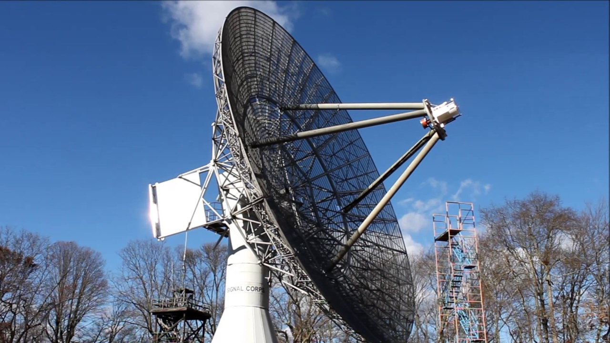

# TLM-18-Wrap-Up-Supervisor
A monitor system to keep track of the number of consecutive 'wraps' the azimuth axis of the TLM-18 radio telescope has completed.

# This project is in progress, the following plan is being implemented:

A standard industrial quadrature encoder is attached to the selsyn shaft to monitor the position of the selsyn pinion.

400 pulses per revolution read in quadrature would give us 1600 PPR (0.225°) resolution at the selsyn pinion. The actual angular resolution of the azimuth axis would be further multiplied by the gear ratio of the pinion and ring gear.

A standard microcontroller would be used to read the quadrature outputs of the encoder and internally keep track of the position. A standard communications link (RS-232 or similar) would be used to communicate the current position back to the computer at specified intervals.

In order to keep track of the position of the telescope during power loss, a small battery backup system will be used to maintain power to the microcontroller during all conditions. Due to the minimal power consumption of the microcontroller/encoder combination, a small lead acid deep cycle battery should be able to maintain power to that system for many hours.

An additional feature that could be implemented is additional sensors to monitor environmental conditions inside the telescope. Temperature and humidity could be logged, as well as a small Inertial Measurement Unit to detect abnormal vibration in the positioning system. Additional sensing capabilities would allow a remote user to detect issues before they get too out of control.

Physically, the electronics would be mounted in a weatherproof enclosure attached somewhere near to the selsyn pinion to keep the encoder wire as short as possible.

# Electrical

The TLM-18 Supervisor system is controlled by an Arduino Nano as the main MCU. This was chosen for ease of software development, ubquity and cost.

The entire system is powered by a small 12v lead acid battery float charger connected to a standard 12v UPS battery. This gives the system a short battery backup supply should mains power be inturrupted.

Attached to the Arduino is an LS7366R SPI Encoder Counter to keep track of the encoder pulses. This will allow high PPR encoders without overwhelming the inturrupt capability of the Arduino at high speeds.

A ADM488ANZ RS-422 transceiver is also attached to allow long distance and isolated communication with the TLM-18 control computer, which will be located a significant distance away and may not be at the same ground potential.

